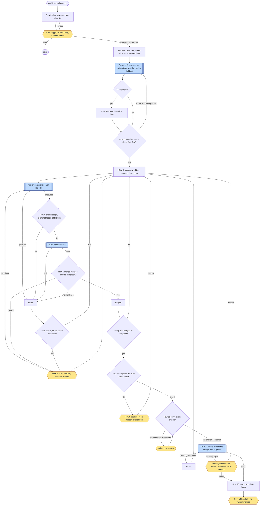
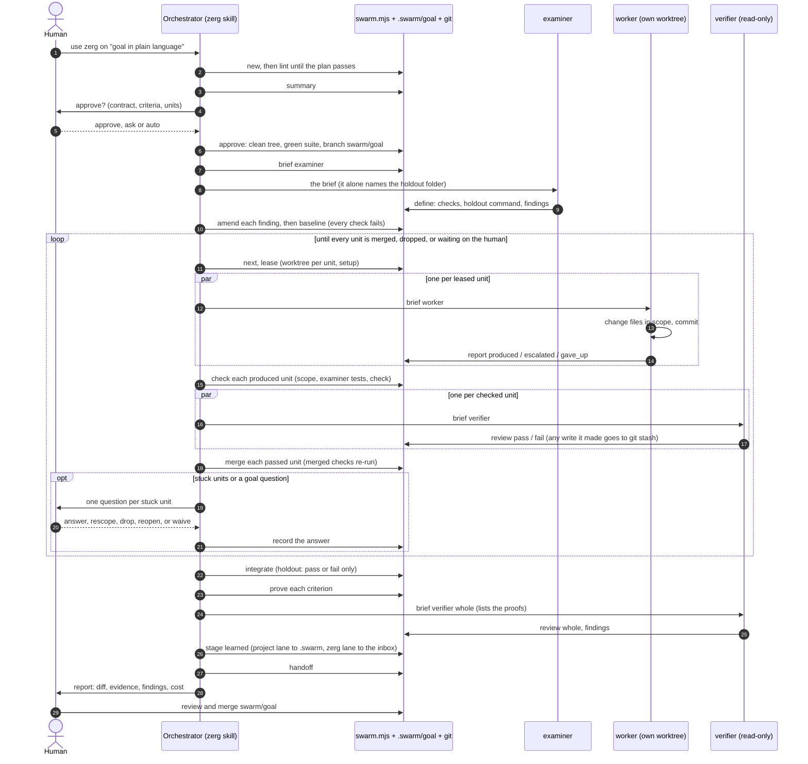

# How zerg runs a goal

The row numbers are the ones `swarm.mjs next` prints. Yellow boxes wait for a human; blue boxes are roles.

## Flow

```mermaid
flowchart TD
    A([goal in plain language]) --> P[Row 2 plan: new, contract, plan, lint]
    P --> AP{{Row 3 approve: summary, then the human}}
    AP -- revise --> P
    AP -- stop --> X([stop])
    AP -- approve, ask or auto --> B[approve: clean tree, green suite, branch swarm/goal]
    B --> D[[Row 4 define: examiner writes tests and the hidden holdout]]
    D --> F{findings open?}
    F -- yes --> AM[Row 4 amend the unit's task] --> BL
    F -- no --> BL{Row 5 baseline: every check fails first?}
    BL -- a check already passes --> D
    BL -- yes --> L[Row 8 lease: a worktree per unit, then setup]
    L --> W[[workers in parallel, each reports]]
    W -- produced --> C{Row 6 check: scope, examiner tests, unit check}
    W -- escalated --> ST{{Row 9 stuck: answer, rescope, or drop}}
    W -- gave up --> R
    C -- fail --> R[revise]
    C -- ok --> V[[Row 6 review: verifier]]
    V -- fail --> R
    V -- pass --> M{Row 6 merge: merged checks still green?}
    M -- no: roll back --> R
    M -- conflict --> ST
    M -- yes --> MG[merged]
    R --> RS{third failure, or the same one twice?}
    RS -- no --> L
    RS -- yes --> ST
    ST --> L
    MG --> ALL{every unit merged or dropped?}
    ALL -- no --> L
    ALL -- yes --> I{Row 10 integrate: full suite and holdout}
    I -- fail --> G1{{Row 9 goal question: reopen or abandon}}
    G1 -- reopen --> L
    I -- pass --> PR{Row 11 prove every criterion}
    PR -- no command proves one --> G3{{waive it, or reopen}}
    G3 --> PR
    PR -- all proven or waived --> WR[[Row 12 whole review: the change and its proofs]]
    WR -- blocking, first time --> AF[add-fix] --> L
    WR -- blocking again --> G2{{Row 9 goal question: reopen, waive whole, or abandon}}
    G2 -- reopen --> L
    G2 -- waive --> LE
    WR -- pass --> LE[Row 13 learn: route both lanes]
    LE --> H{{Row 14 hand off: the human merges}}

    classDef human fill:#fde68a,stroke:#92400e,color:#1f2937
    classDef role fill:#bfdbfe,stroke:#1e3a8a,color:#1f2937
    class AP,ST,G1,G2,G3,H human
    class D,W,V,WR role
```

## Who talks to whom

```mermaid
sequenceDiagram
    autonumber
    actor H as Human
    participant O as Orchestrator (zerg skill)
    participant S as swarm.mjs + .swarm/goal + git
    participant E as examiner
    participant W as worker (own worktree)
    participant V as verifier (read-only)

    H->>O: use zerg on "goal in plain language"
    O->>S: new, then lint until the plan passes
    O->>S: summary
    O->>H: approve? (contract, criteria, units)
    H-->>O: approve, ask or auto
    O->>S: approve: clean tree, green suite, branch swarm/goal
    O->>S: brief examiner
    O->>E: the brief (it alone names the holdout folder)
    E->>S: define: checks, holdout command, findings
    O->>S: amend each finding, then baseline (every check fails)

    loop until every unit is merged, dropped, or waiting on the human
        O->>S: next, lease (worktree per unit, setup)
        par one per leased unit
            O->>W: brief worker
            W->>W: change files in scope, commit
            W->>S: report produced / escalated / gave_up
        end
        O->>S: check each produced unit (scope, examiner tests, check)
        par one per checked unit
            O->>V: brief verifier
            V->>S: review pass / fail (any write it made goes to git stash)
        end
        O->>S: merge each passed unit (merged checks re-run)
        opt stuck units or a goal question
            O->>H: one question per stuck unit
            H-->>O: answer, rescope, drop, reopen, or waive
            O->>S: record the answer
        end
    end

    O->>S: integrate (holdout: pass or fail only)
    O->>S: prove each criterion
    O->>V: brief verifier whole (lists the proofs)
    V->>S: review whole, findings
    O->>S: stage learned (project lane to .swarm, zerg lane to the inbox)
    O->>S: handoff
    O->>H: report: diff, evidence, findings, cost
    H->>S: review and merge swarm/goal
```
